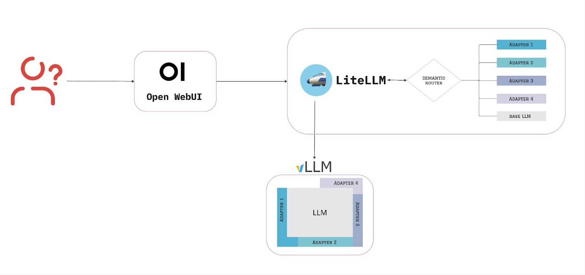

# Dynamic Model Routing with Semantic Evaluation and LoRA Adapters
Welcome to the LLM Dynamic Model Routing kickstart! Use this to quickly deploy a semantic router with LoRA adapters and a fallback base model using LiteLLM and vLLM.

# Description
This kickstart demonstrates how to build a cost-efficient and scalable LLM deployment by combining semantic routing, LoRA adapters, and vLLM on Red Hat OpenShift AI. Incoming user requests are processed through LiteLLM, semantically evaluated, and routed to the most appropriate LoRA adapter or the default base model to ensure more precise and context-aware responses without hosting multiple full models.

# Architecture diagrams
The architecture integrates several components to ensure efficient request handling and accurate responses. [Open WebUI](https://openwebui.com/) provides an intuitive interface for users to interact smoothly with the system, and [LiteLLM](https://www.litellm.ai/), which acts as a proxy, utilizes the [semantic router](https://github.com/aurelio-labs/semantic-router) to determine which is the most suitable destination—whether it’s the base model or a specialized LoRA adapter. Based on this decision, LiteLLM forwards the request to [vLLM](https://github.com/vllm-project/vllm) for inference.



# References
* [Creating cost effective specialized AI solutions with LoRA adapters on Red Hat OpenShift AI
](https://www.redhat.com/en/blog/creating-cost-effective-specialized-ai-solutions-lora-adapters-red-hat-openshift-ai)
* https://le.qun.ch/en/blog/2023/09/11/multi-lora-potentials/
* https://le.qun.ch/en/blog/2023/05/13/transformer-batching/

# Minimum hardware requirements
This demo is designed to run a model using GPU acceleration. The following hardware resources are required:
- CPU: 1 vCPU
- Memory: 4 GiB
- GPU: 1 NVIDIA GPU (e.g., A10, A100, L40S, or similar)
  
# Required software
- Red Hat OpenShift
- Red Hat OpenShift AI

# Required permissions
- Standard user. No elevated cluster permissions required.

# Install
Let’s dive into the technical aspects of building this setup with a practical example. We are using the [Phi-2](https://huggingface.co/microsoft/phi-2) LLM as the base model, and two LoRA adapters [Phi2-Doctor28e](https://huggingface.co/petualang/Phi2-Doctor28e/tree/main) and [phi-2-dcot](https://huggingface.co/haritzpuerto/phi-2-dcot).

This repository packages all the required components as a helm chart, which helps you deploy with one command.

## Clone
```bash
git clone https://github.com/rh-ai-kickstart/vllm-router-demo
cd vllm-router-demo/chart
```

## Create a project
```bash
PROJECT="vllm-router-demo-demo"
oc new-project ${PROJECT}
```

## Install with Helm
```bash
helm install vllm-router-demo . --namespace ${PROJECT}
```

## Validating the deployment
After deployment, verify that the setup works as expected by logging into Open WebUI and sending various queries. By checking the LiteLLM logs, you can ensure that requests are correctly routed to either the base model or the relevant adapter.

For instance, in a clinical healthcare scenario, if you ask, “Is there medication for my symptoms?” the query will be routed to the `phi-2-doctor` adapter. You can then verify the routing by checking the LiteLLM logs, as shown below.

_Please keep in mind that while the model may provide useful information, all output should be reviewed for its suitability and it is essential to consult a professional for personalized advice._

To validate the connection between the OpenWebUI and the LiteLLM proxy click on the top left and you should see _phi2_, _dcot_ and _doctor_ models listed. And to confirm that the proxy is working, you should see similar logs in LiteLLM pod as you ask questions.

```
LiteLLM: Proxy initialized with Config, Set models:
dcot
doctor
phi2
INFO: 10.131.166.110:55626 - "GET /models HTTP/1.1" 200 OK
INFO: 10.131.166.110:52568 - "GET /models HTTP/1.1" 200 OK
[RouteChoice(name='dcot', function_call=None, similarity_score=0.6218189497571418), RouteChoice(name='doctor', function_call=None, similarity_score=0.6802293320602901)]
doctor
INFO: 10.131.166.110:52576 - "POST /chat/completions HTTP/1.1" 200 OK
```

# Configuring the Semantic Router

The semantic router is invoked by a LiteLLM pre-invoke function and is run before the call to the actual LLM endpoint is made. This functions uses the **semantic router** framework to decide which models the request should be sent to.

The code is located in [litellm-config/custom_router.py](chart/litellm-configs/custom_router.py) if you'd like to make changes.

# Uninstall
```bash
helm uninstall vllm-router-demo --namespace ${PROJECT} 
```